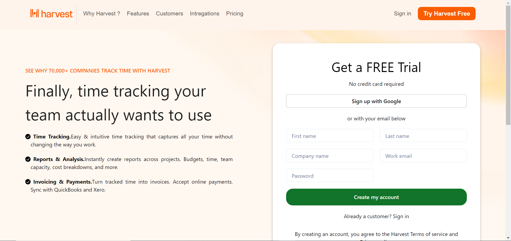

# afraid-shoe-4639

# Harvest-Clone

Hello Everyone,  we would like to share our Experience in this Construction Week, this time Masai School give me and my team members an oppotunity to build a cloned website of Harvest as a part of our Unit-5 construct week.

This was a group project executed within a 4 days of span.

Have a look ⬇️

## Tech Stack

**Client:**  React, Redux, JavaScript, MogoDB, Express, Redux-Thunk, Chakra UI 

**Deploying:** Netlify, Heroku

## Screenshots

##Contributors:
## Shabaz  -   @shabazalimalik69
## Akash   -   @AkashKeshari111
## Ankur   -   @Ankur982
## Sumit   -   @SumitKDSarkar
## Sombir  -   @sombir5

## THANK YOU ❤️

